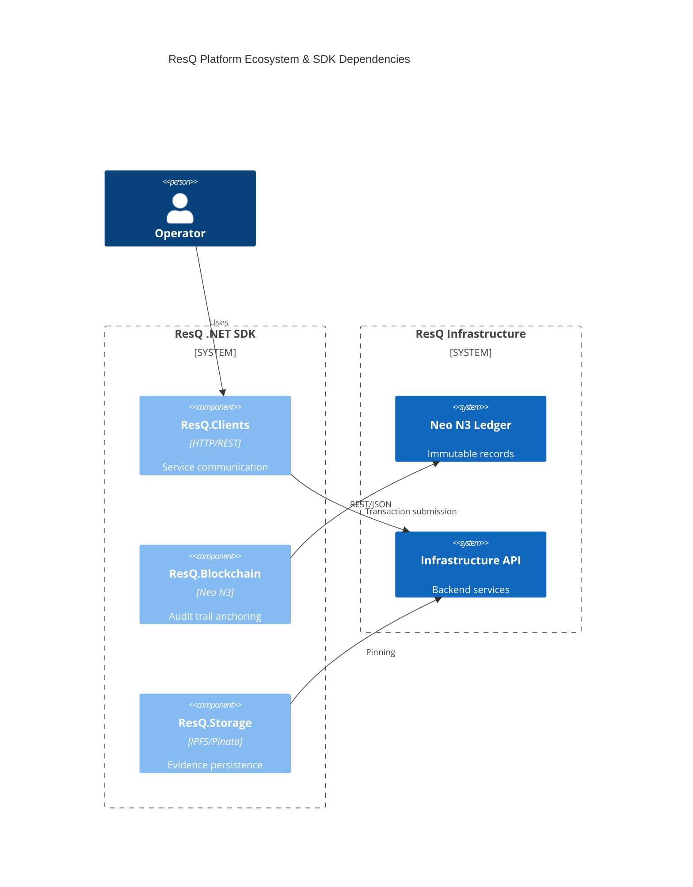
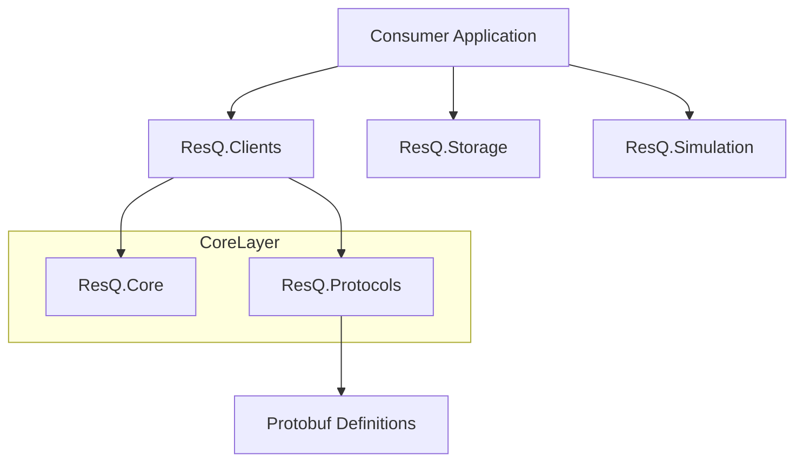

# ResQ .NET SDK

[](https://github.com/resq-software/dotnet-sdk/actions)
[](https://www.nuget.org/packages/ResQ.Protocols)
[](https://www.nuget.org/packages/ResQ.Clients)
[](https://www.nuget.org/packages/ResQ.Core)
[](LICENSE)

> .NET 9 typed clients and blockchain anchoring for the ResQ autonomous drone platform.

## Packages

| Package | Install | Version |
|---------|---------|---------|
| `ResQ.Protocols` | `dotnet add package ResQ.Protocols` | [](https://www.nuget.org/packages/ResQ.Protocols) |
| `ResQ.Clients` | `dotnet add package ResQ.Clients` | [](https://www.nuget.org/packages/ResQ.Clients) |
| `ResQ.Core` | `dotnet add package ResQ.Core` | [](https://www.nuget.org/packages/ResQ.Core) |

## Overview

The ResQ .NET SDK provides typed client libraries, domain models, and protocol bindings for the [ResQ platform](https://resq.software). It targets .NET 9 and facilitates high-performance communication with autonomous drone fleets, blockchain-based telemetry anchoring, and disaster simulation environments.

## Features

- **Neo N3 Blockchain Support:** Integrated auditing and data anchoring for mission-critical telemetry.
- **SITL Simulation Harness:** Native tools to run Software-in-the-Loop simulations with virtual drone fleets.
- **Protobuf-Native:** High-performance binary serialization using standardized `.proto` definitions.
- **Typed Service Clients:** Robust wrappers for the ResQ Infrastructure and Coordination (HCE) APIs.
- **Cross-Platform:** Built for .NET 9 with Nix-based development environment consistency.

## Architecture

The SDK is organized into modular libraries. The `ResQ.Clients` and `ResQ.Blockchain` layers consume `ResQ.Core` models, while `ResQ.Protocols` provides the shared gRPC contract definitions.





## Installation

Add the necessary packages to your .NET 9 project via CLI:

```bash
# Core domain models and interfaces
dotnet add package ResQ.Core

# Typed HTTP clients
dotnet add package ResQ.Clients

# Blockchain integration
dotnet add package ResQ.Blockchain
```

## Quick Start

Initialize a client and fetch fleet telemetry:

```csharp
using ResQ.Clients;

// Initialize the API client
var client = new InfrastructureApiClient("https://api.resq.software");

// Perform a request
var telemetry = await client.GetTelemetryAsync("drone-01");
Console.WriteLine($"Current Battery: {telemetry.BatteryLevel}%");
```

## Usage

### Blockchain Anchoring
Secure mission data on the Neo N3 ledger:

```csharp
using ResQ.Blockchain;

var neo = new NeoClient(new NeoClientOptions { RpcUrl = "http://localhost:10332" });
var tx = await neo.AnchorMissionAsync(missionId: "mission-99", dataHash: "ipfs://...");
```

### Simulation Testing
Use the SITL harness to validate flight paths without physical hardware:

```csharp
using ResQ.Simulation;

var drone = new VirtualDrone("drone-id");
await drone.ConnectAsync();
await drone.ExecuteFlightPathAsync(waypoints);
```

## Configuration

| Environment Variable | Description | Default |
| :--- | :--- | :--- |
| `RESQ_API_URL` | Base endpoint for ResQ services | `https://api.resq.software` |
| `NEO_RPC_URL` | Neo N3 RPC endpoint | `http://localhost:10332` |
| `NEO_MOCK_MODE` | Toggle mock blockchain for local dev | `false` |

The SDK supports configuration via environment variables and standard .NET configuration providers (e.g., `appsettings.json`). For libraries, settings should be injected via `IOptions<T>` pattern.

For example, to configure the `InfrastructureApiClient` via `appsettings.json`:

```json
{
  "ResQ": {
    "InfrastructureApiUrl": "https://your-api.example.com",
    "Resilience": {
      "MaxRetries": 5,
      "RequestTimeoutSec": 15
    }
  }
}
```

Then, in your application's `Startup.cs` or equivalent:

```csharp
// Register InfrastructureApiClient with base address from config
services.AddHttpClient<InfrastructureApiClient>(c =>
{
    c.BaseAddress = new Uri(
        Configuration["ResQ:InfrastructureApiUrl"] ?? "https://api.resq.software");
});

// Optional: bind strongly-typed options
services.Configure<PinataOptions>(Configuration.GetSection("PinataOptions"));
```

## API Reference

- **`ResQ.Core`**: Contains shared domain entities (`Location`, `Telemetry`, `IncidentType`) and service interfaces.
- **`ResQ.Protocols`**: Houses auto-generated gRPC contracts and protocol-specific extension methods.
- **`ResQ.Clients`**: Provides high-level abstractions for infrastructure APIs, including built-in Polly-based retry/circuit-breaker logic.
- **`ResQ.Storage`**: Implements IPFS storage adapters using Pinata.
- **Error Handling & Retries**: Clients utilize `Polly.ResiliencePipeline` to handle 429 (Rate Limit), 408 (Timeout), and 5xx (Server) errors with exponential backoff and circuit-breaking strategies.

## Testing

The SDK includes comprehensive unit and integration tests for its various components. You can run these tests using the `dotnet test` command.

```bash
dotnet test -c Release
```

The `ResQ.Clients.Tests` project uses `MockHttpMessageHandler` to simulate HTTP responses, allowing for thorough testing of resilience policies like retries and circuit breakers without actual network calls.

The `ResQ.Blockchain` project provides `MockNeoClient` for testing blockchain interactions in memory.

To facilitate testing of your own code that uses the ResQ SDK, you can leverage these mock implementations:

1.  **Dependency Injection**: Register mock implementations in your test setup.
    ```csharp
    // In your test setup
    services.AddSingleton&lt;INeoClient, MockNeoClient&gt;();
    services.AddSingleton&lt;IStorageClient, MockPinataClient&gt;(); // Assuming a mock for storage
    services.AddSingleton&lt;CoordinationHceClient&gt;(); // Use DI for clients too
    ```

2.  **Mocking HTTP Handlers**: For clients like `InfrastructureApiClient` and `CoordinationHceClient`, inject a `MockHttpMessageHandler` to control HTTP responses.
    ```csharp
    var mockHandler = new MockHttpMessageHandler();
    mockHandler.QueueJsonResponse(System.Net.HttpStatusCode.OK, "{\"Token\": \"fake-jwt-token\"}");
    var client = new CoordinationHceClient("http://localhost", mockHandler);
    ```

This allows you to isolate your code's logic from external dependencies and verify its behavior under various conditions, including error scenarios.

## Shared Protobuf Source

The checked-in `protos/` directory is a synced local cache of the canonical schemas published from `buf.build/resq-software/resq-proto`.

When updating shared contracts:

```bash
# Requires private BSR auth (e.g., BUF_TOKEN set or Buf CLI logged in)
bash scripts/sync-protos.sh && dotnet build ResQ.Protocols/ResQ.Protocols.csproj
```

## Development

### Prerequisites
- .NET 9.0 SDK
- Docker (for packaging and integration tests)
- Nix (optional, for development environment parity)

### Setup
```bash
git clone https://github.com/resq-software/dotnet-sdk.git
./scripts/setup.sh
dotnet build
```

### Versioning and Compatibility Policy
The ResQ SDK follows [Semantic Versioning (SemVer)](https://semver.org/).
- **Major:** Breaking API changes.
- **Minor:** New features, non-breaking.
- **Patch:** Bug fixes and security patches.

## Contributing

We strictly follow the [Conventional Commits](https://www.conventionalcommits.org/) specification.

1.  **Fork** the repository.
2.  **Branch** your changes: `feat/my-feature` or `fix/my-bug`.
3.  **Commit** using clear, imperative messages.
4.  **Push** and open a Pull Request.

All changes must pass existing CI workflows and include tests for new functionality.

## License

Copyright 2026 ResQ. Licensed under the [Apache License, Version 2.0](./LICENSE).
