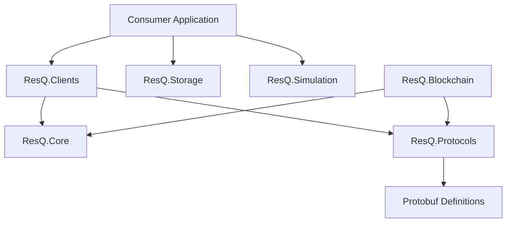

# ResQ .NET SDK

<p align="center">
  .NET 9 client libraries for integrating with the ResQ autonomous disaster-response platform.
</p>

<p align="center">
  <a href="https://github.com/resq-software/dotnet-sdk/actions/workflows/ci.yml">
    
  </a>
  <a href="https://www.nuget.org/packages/ResQ.Core">
    
  </a>
  <a href="https://codecov.io/gh/resq-software/dotnet-sdk">
    
  </a>
  <a href="./LICENSE">
    
  </a>
</p>

---

## Table of Contents

- [Overview](#overview)
- [Features](#features)
- [Architecture](#architecture)
- [Quick Start](#quick-start)
- [Usage](#usage)
- [Configuration](#configuration)
- [API Overview](#api-overview)
- [Development](#development)
- [Contributing](#contributing)
- [Roadmap](#roadmap)
- [License](#license)

---

## Overview

The ResQ .NET SDK provides typed client libraries, domain models, and protocol bindings for the [ResQ platform](https://resq.software). It targets .NET 9 and facilitates high-performance communication with autonomous drone fleets, blockchain-based telemetry anchoring, and disaster simulation environments.

## Features

- **Typed Clients:** Ready-to-use gRPC and REST wrappers for core infrastructure.
- **Blockchain Integration:** Built-in Neo N3 support for mission integrity and IPFS data anchoring.
- **Protobuf Native:** Fully generated message types from standardized `.proto` definitions.
- **Simulation Harness:** Tools to run SITL (Software-in-the-Loop) tests with virtual drones.
- **Cross-Platform:** Built for .NET 9 with Linux/macOS support via Nix.

## Architecture

The SDK is structured into modular libraries to minimize footprint and dependency bloat.



## Quick Start

Add the core packages via CLI:

```bash
dotnet add package ResQ.Core
dotnet add package ResQ.Clients
```

Initialize a client and fetch fleet telemetry:

```csharp
using ResQ.Clients;

var client = new InfrastructureApiClient("https://api.resq.software");
var telemetry = await client.GetTelemetryAsync("drone-01");

Console.WriteLine($"Current Battery: {telemetry.BatteryLevel}%");
```

## Usage

### Blockchain Anchoring
Easily pin mission data to the Neo N3 ledger to ensure auditability:

```csharp
using ResQ.Blockchain;

var neo = new NeoClient(new NeoClientOptions { RpcUrl = "http://localhost:10332" });
var tx = await neo.AnchorMissionAsync(missionId: "mission-99", dataHash: "ipfs://...");
Console.WriteLine($"Mission anchored: {tx.Hash}");
```

### Simulation Testing
Use the `VirtualDrone` harness for testing flight paths without deploying hardware:

```csharp
using ResQ.Simulation;

var drone = new VirtualDrone("drone-id");
await drone.ConnectAsync();
await drone.ExecuteFlightPathAsync(waypoints);
```

## Configuration

| Environment Variable | Description | Default |
| :--- | :--- | :--- |
| `RESQ_API_URL` | Base endpoint for ResQ services | `https://api.resq.software` |
| `NEO_RPC_URL` | Neo N3 RPC endpoint | `http://localhost:10332` |
| `NEO_MOCK_MODE` | Toggle mock blockchain for local dev | `true` |

## API Overview

- **`ResQ.Core`**: Common domain entities (`Location`, `Telemetry`, `IncidentType`).
- **`ResQ.Protocols`**: gRPC service definitions for `DroneService`, `SimulationService`, and `TelemetryService`.
- **`ResQ.Clients`**: High-level abstractions for interaction, handling serialization and error retries.
- **`ResQ.Storage`**: Pinata/IPFS adapters for mission artifacts.

## Development

### Prerequisites
- .NET 9.0 SDK
- Docker (for packaging and integration tests)
- Nix (optional, for development environment consistency)

### Setup
```bash
git clone https://github.com/resq-software/dotnet-sdk.git
./scripts/setup.sh
dotnet build
```

### Testing
We use a suite of unit and integration tests. Run them using:
```bash
dotnet test
```

## Contributing

We strictly follow the [Conventional Commits](https://www.conventionalcommits.org/) specification.

1. **Fork** the repository.
2. **Branch** your changes: `feat/my-feature` or `fix/my-bug`.
3. **Commit** using clear, imperative messages.
4. **Push** and open a Pull Request.

All changes must pass existing CI workflows and include tests for new functionality. Check the `tests/` directory for existing patterns.

## Roadmap

- [ ] **v1.1.0:** Enhanced gRPC streaming support for real-time telemetry.
- [ ] **v1.2.0:** Auto-generated Swagger/OpenAPI definitions for Infrastructure API.
- [ ] **v2.0.0:** Native AOT compatibility across all library modules.

## License

Copyright 2026 ResQ. Licensed under the [Apache License, Version 2.0](./LICENSE).