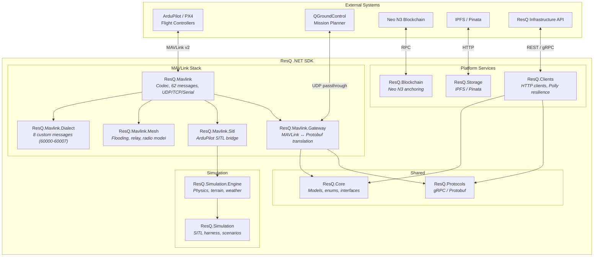
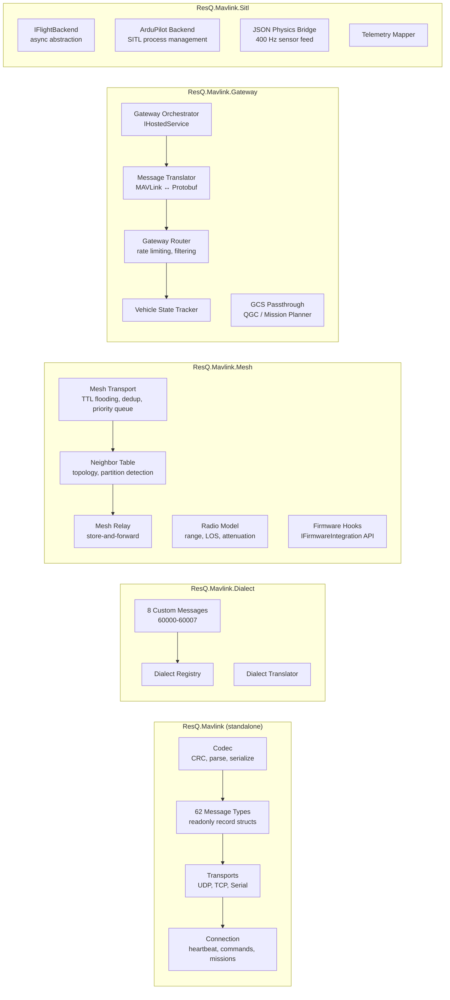
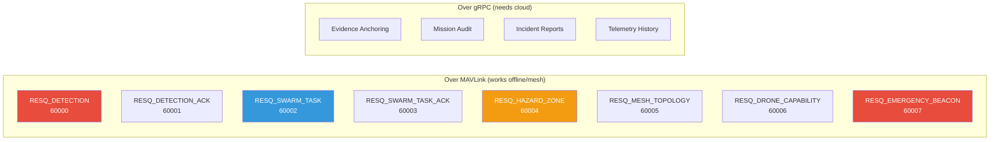
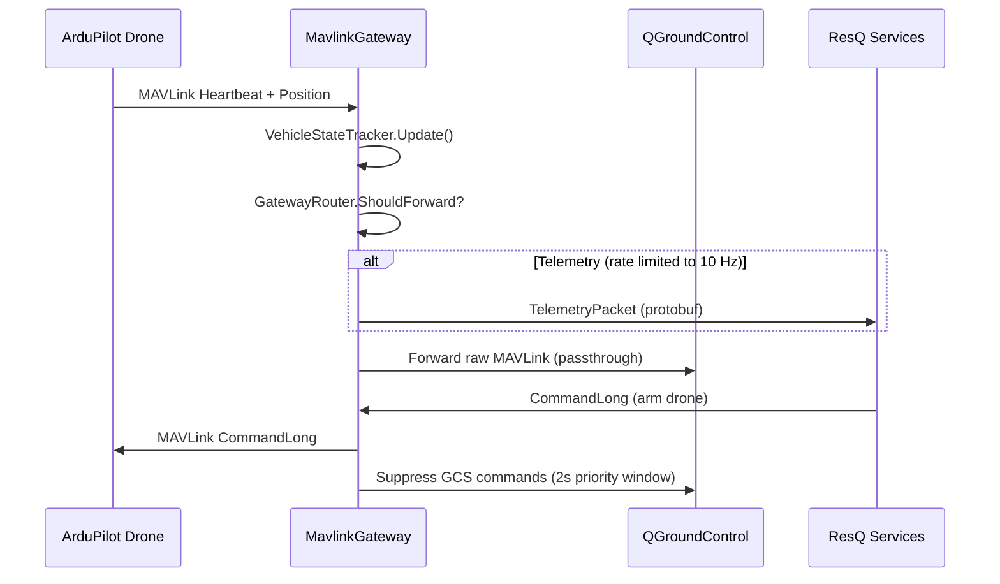
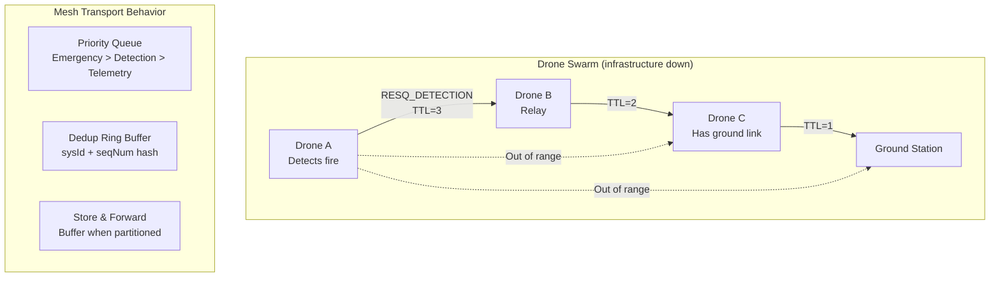
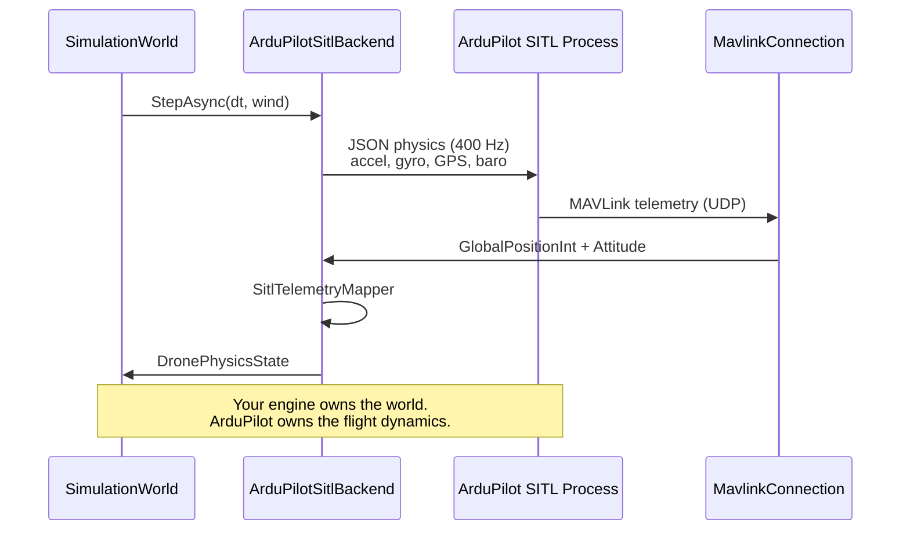
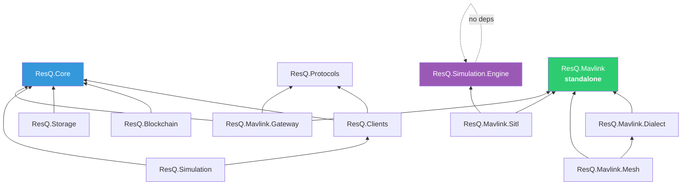

# ResQ .NET SDK

[](https://github.com/resq-software/dotnet-sdk/actions)
[](https://www.nuget.org/packages/ResQ.Core)
[](https://www.nuget.org/packages/ResQ.Mavlink)
[](https://www.nuget.org/packages/ResQ.Protocols)
[](LICENSE)

> Full-stack .NET 9 SDK for the ResQ autonomous drone disaster-response platform: MAVLink protocol, ArduPilot SITL integration, mesh networking, protocol gateway, blockchain anchoring, and physics-based simulation.

---

## Architecture



## Project Map



## Packages

| Package | Description | Install |
|---------|-------------|---------|
| **ResQ.Mavlink** | MAVLink v2 codec, 62 messages, UDP/TCP/Serial transports | `dotnet add package ResQ.Mavlink` |
| **ResQ.Mavlink.Dialect** | Custom ResQ MAVLink messages (detection, swarm, hazard, mesh, beacon) | `dotnet add package ResQ.Mavlink.Dialect` |
| **ResQ.Mavlink.Mesh** | Mesh transport with flooding, relay, radio simulation | `dotnet add package ResQ.Mavlink.Mesh` |
| **ResQ.Mavlink.Sitl** | ArduPilot SITL bridge with `IFlightBackend` abstraction | `dotnet add package ResQ.Mavlink.Sitl` |
| **ResQ.Mavlink.Gateway** | Protocol gateway (MAVLink ↔ Protobuf) as `IHostedService` | `dotnet add package ResQ.Mavlink.Gateway` |
| **ResQ.Simulation.Engine** | Physics-based drone simulation (kinematic + quadrotor models) | `dotnet add package ResQ.Simulation.Engine` |
| **ResQ.Core** | Domain models, enums, service interfaces | `dotnet add package ResQ.Core` |
| **ResQ.Protocols** | gRPC/Protobuf contract definitions | `dotnet add package ResQ.Protocols` |
| **ResQ.Clients** | Typed HTTP clients with Polly resilience | `dotnet add package ResQ.Clients` |
| **ResQ.Blockchain** | Neo N3 blockchain anchoring | `dotnet add package ResQ.Blockchain` |
| **ResQ.Storage** | IPFS/Pinata evidence storage | `dotnet add package ResQ.Storage` |

## Quick Start

### Send MAVLink commands to a drone

```csharp
using ResQ.Mavlink.Transport;
using ResQ.Mavlink.Connection;
using ResQ.Mavlink.Messages;
using ResQ.Mavlink.Enums;

// Connect via UDP
await using var transport = new UdpTransport(new UdpTransportOptions
{
    ListenPort = 14550,
    RemotePort = 5760,
});
await using var connection = new MavlinkConnection(transport, new MavlinkConnectionOptions());

// Arm the drone
await connection.SendMessageAsync(new CommandLong
{
    TargetSystem = 1,
    TargetComponent = 1,
    Command = MavCmd.ComponentArmDisarm,
    Param1 = 1.0f,
});

// Receive telemetry
await foreach (var packet in transport.ReceiveAsync())
{
    if (MessageRegistry.TryDeserialize(packet.MessageId, packet.Payload.ToArray(), out var msg)
        && msg is GlobalPositionInt pos)
    {
        Console.WriteLine($"Lat: {pos.Lat / 1e7:F6}, Lon: {pos.Lon / 1e7:F6}, Alt: {pos.Alt / 1000.0:F1}m");
    }
}
```

### Run the protocol gateway

```csharp
using ResQ.Mavlink.Gateway;
using Microsoft.Extensions.Options;

await using var gateway = new MavlinkGateway(
    Options.Create(new MavlinkGatewayOptions { VehicleListenPort = 14550 }),
    Options.Create(new GatewayRoutingOptions()),
    Options.Create(new GcsPassthroughOptions { Enabled = true })
);

await gateway.StartAsync(CancellationToken.None);

// Read translated ResQ telemetry
await foreach (var telemetry in gateway.TelemetryFeed(CancellationToken.None))
{
    Console.WriteLine($"[{telemetry.DroneId}] {telemetry.Position.Latitude:F6}, " +
        $"{telemetry.Position.Longitude:F6} | Battery: {telemetry.BatteryPercent}%");
}
```

### Simulate a drone swarm

```csharp
using ResQ.Simulation.Engine.Core;
using ResQ.Simulation.Engine.Environment;
using ResQ.Simulation.Engine.Physics;
using Microsoft.Extensions.Options;
using System.Numerics;

var config = new SimulationConfig { FlightModel = FlightModelType.Quadrotor };
var world = new SimulationWorld(
    Options.Create(config),
    new FlatTerrain(),
    new WeatherSystem(Options.Create(new WeatherConfig()))
);

// Spawn 10 drones in formation
for (var i = 0; i < 10; i++)
    world.AddDrone($"drone-{i}", new Vector3(i * 50, 0, 0));

// Run 60 seconds of simulation at 60 Hz
for (var tick = 0; tick < 3600; tick++)
{
    world.Step();
    if (tick % 60 == 0) // Log every second
    {
        var drone = world.Drones[0];
        var state = drone.FlightModel.State;
        Console.WriteLine($"t={world.Clock.ElapsedTime:F1}s " +
            $"pos=({state.Position.X:F1}, {state.Position.Y:F1}, {state.Position.Z:F1}) " +
            $"battery={state.BatteryPercent:F0}%");
    }
}
```

### Test mesh networking

```csharp
using ResQ.Mavlink.Mesh;
using ResQ.Mavlink.Mesh.Simulation;
using Microsoft.Extensions.Options;
using System.Numerics;

var radio = new RadioModel(Options.Create(new RadioModelOptions
{
    MaxRangeMetres = 500,
}));

// Three drones: A can reach B, B can reach C, but A cannot reach C directly
var droneA = new Vector3(0, 50, 0);
var droneB = new Vector3(300, 50, 0);
var droneC = new Vector3(700, 50, 0);

Console.WriteLine($"A-B: {radio.CanCommunicate(droneA, droneB)}");  // true  (300m < 500m)
Console.WriteLine($"A-C: {radio.CanCommunicate(droneA, droneC)}");  // false (700m > 500m)
Console.WriteLine($"B-C: {radio.CanCommunicate(droneB, droneC)}");  // true  (400m < 500m)
// B relays messages between A and C via mesh transport
```

## Custom ResQ MAVLink Dialect

The SDK extends MAVLink with 8 disaster-response messages in the 60000-60255 reserved range:



Register the dialect at startup:

```csharp
using ResQ.Mavlink.Dialect;

// One-time registration — enables dialect messages in codec and registry
ResqDialectRegistry.Register();
```

## Protocol Gateway Data Flow



## Mesh Transport



## ArduPilot SITL Integration



### Running with ArduPilot SITL

```bash
# Install ArduPilot SITL
git clone https://github.com/ArduPilot/ardupilot.git
cd ardupilot && git submodule update --init --recursive
./waf configure --board sitl && ./waf copter

# Add to PATH
export PATH="$PWD/build/sitl/bin:$PATH"

# Run SITL integration tests
cd /path/to/dotnet-sdk
dotnet test --filter "Category=Integration"
```

## Configuration

All configuration uses the `IOptions<T>` pattern:

| Class | Key Settings | Defaults |
|-------|-------------|----------|
| `MavlinkConnectionOptions` | `SystemId`, `HeartbeatInterval`, `CommandAckTimeout` | 255, 1s, 1500ms |
| `UdpTransportOptions` | `ListenPort`, `RemoteHost`, `RemotePort` | 14550, 127.0.0.1, 14550 |
| `TcpTransportOptions` | `Host`, `Port`, `ReconnectDelay`, `IsServer` | 127.0.0.1, 5760, 2s, false |
| `MavlinkGatewayOptions` | `VehicleListenPort`, `GatewaySystemId` | 14550, 255 |
| `GatewayRoutingOptions` | `TelemetryRateLimitHz`, `InternalOnlyMessageIds` | 10, {0} |
| `GcsPassthroughOptions` | `GcsListenPort`, `ResqPriorityOverride` | 14551, true |
| `MeshTransportOptions` | `DefaultTtl`, `EmergencyTtl`, `DeduplicationWindowSize` | 3, 7, 256 |
| `RadioModelOptions` | `MaxRangeMetres`, `AttenuationFactor` | 500, 2.0 |
| `SimulationConfig` | `DeltaTime`, `Seed`, `FlightModel`, `ClockMode` | 1/60, 42, Kinematic, Stepped |
| `SitlProcessManagerOptions` | `SitlBinaryPath`, `BasePort`, `MaxInstances` | "arducopter", 5760, 20 |

### Environment Variables

| Variable | Description | Default |
|----------|-------------|---------|
| `RESQ_API_URL` | ResQ Infrastructure API endpoint | `https://api.resq.software` |
| `NEO_RPC_URL` | Neo N3 RPC endpoint | `http://localhost:10332` |
| `NEO_MOCK_MODE` | Use mock blockchain for local dev | `false` |

## Development

### Prerequisites

- .NET 9.0 SDK (or 10.x with `latestMajor` rollForward)
- Docker (optional, for packaging)
- Nix (optional, for environment parity)
- ArduPilot SITL (optional, for integration tests)

### Build and Test

```bash
git clone https://github.com/resq-software/dotnet-sdk.git
cd dotnet-sdk

dotnet build -c Release              # Build all 13 projects
dotnet test -c Release               # Run full test suite (448 tests)
dotnet format --verify-no-changes    # Check formatting (CI gate)
dotnet pack -c Release --no-build    # Produce NuGet packages
```

### Test Categories

```bash
# All unit tests (no external dependencies)
dotnet test --filter "Category!=Integration&Category!=Hardware"

# ArduPilot SITL tests (requires arducopter on PATH)
dotnet test --filter "Category=Integration"

# Serial port tests (requires real hardware)
dotnet test --filter "Category=Hardware"
```

### Shared Protobuf Source

```bash
# Sync protos from buf.build (requires BUF_TOKEN)
bash scripts/sync-protos.sh
dotnet build ResQ.Protocols/ResQ.Protocols.csproj
```

## Dependency Graph



> `ResQ.Mavlink` has zero SDK dependencies and can be used standalone by any .NET project that needs a MAVLink v2 library.

## Contributing

We follow [Conventional Commits](https://www.conventionalcommits.org/) and [SemVer](https://semver.org/).

1. **Fork** the repository
2. **Branch**: `feat/my-feature` or `fix/my-bug`
3. **Test**: all 448 tests must pass, `dotnet format` must be clean
4. **PR**: open against `main`

## License

Copyright 2026 ResQ. Licensed under the [Apache License, Version 2.0](./LICENSE).
