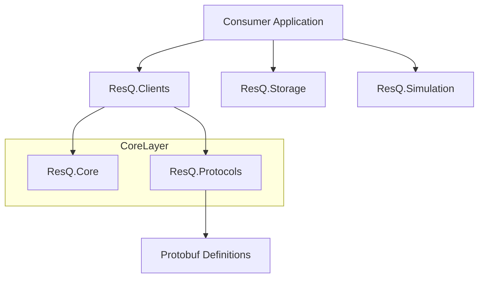

# ResQ .NET SDK

<p align="center">
  A collection of .NET 9 client libraries for interacting with the ResQ autonomous disaster-response platform.
</p>

<p align="center">
  <a href="https://github.com/resq-software/dotnet-sdk/actions/workflows/ci.yml">
    
  </a>
  <a href="https://www.nuget.org/packages/ResQ.Core">
    
  </a>
  <a href="https://codecov.io/gh/resq-software/dotnet-sdk">
    
  </a>
  <a href="./LICENSE">
    
  </a>
</p>

## Overview

The ResQ .NET SDK provides typed client libraries, domain models, and protocol bindings for the [ResQ platform](https://resq.software). It targets .NET 9 and facilitates high-performance communication with autonomous drone fleets, blockchain-based telemetry anchoring, and disaster simulation environments.

## Features

- **Neo N3 Blockchain Support:** Integrated auditing and data anchoring for mission-critical telemetry.
- **SITL Simulation Harness:** Native tools to run Software-in-the-Loop simulations with virtual drone fleets.
- **Protobuf-Native:** High-performance binary serialization using standardized `.proto` definitions.
- **Typed Service Clients:** Robust wrappers for the ResQ Infrastructure and Coordination (HCE) APIs.
- **Cross-Platform:** Built for .NET 9 with Nix-based development environment consistency.

## Architecture

The SDK is organized into modular libraries. The `ResQ.Clients` and `ResQ.Blockchain` layers consume `ResQ.Core` models, while `ResQ.Protocols` provides the shared gRPC contract definitions.

```mermaid
c4Context
    title ResQ Platform Ecosystem & SDK Dependencies

    Person(operator, "Operator")
    System_Boundary(resq_sdk, "ResQ .NET SDK") {
        Component(clients, "ResQ.Clients", "HTTP/REST", "Service communication")
        Component(blockchain, "ResQ.Blockchain", "Neo N3", "Audit trail anchoring")
        Component(storage, "ResQ.Storage", "IPFS/Pinata", "Evidence persistence")
    }
    
    System_Boundary(platform, "ResQ Infrastructure") {
        System(neo, "Neo N3 Ledger", "Immutable records")
        System(api, "Infrastructure API", "Backend services")
    }

    Rel(operator, clients, "Uses")
    Rel(clients, api, "REST/JSON")
    Rel(blockchain, neo, "Transaction submission")
    Rel(storage, api, "Pinning")
```



## Installation

Add the necessary packages to your .NET 9 project via CLI:

```bash
# Core domain models and interfaces
dotnet add package ResQ.Core

# Typed HTTP clients
dotnet add package ResQ.Clients

# Blockchain integration
dotnet add package ResQ.Blockchain
```

## Quick Start

Initialize a client and fetch fleet telemetry:

```csharp
using ResQ.Clients;

// Initialize the API client
var client = new InfrastructureApiClient("https://api.resq.software");

// Perform a request
var telemetry = await client.GetTelemetryAsync("drone-01");
Console.WriteLine($"Current Battery: {telemetry.BatteryLevel}%");
```

## Usage

### Blockchain Anchoring
Secure mission data on the Neo N3 ledger:

```csharp
using ResQ.Blockchain;

var neo = new NeoClient(new NeoClientOptions { RpcUrl = "http://localhost:10332" });
var tx = await neo.AnchorMissionAsync(missionId: "mission-99", dataHash: "ipfs://...");
```

### Simulation Testing
Use the SITL harness to validate flight paths without physical hardware:

```csharp
using ResQ.Simulation;

var drone = new VirtualDrone("drone-id");
await drone.ConnectAsync();
await drone.ExecuteFlightPathAsync(waypoints);
```

## Configuration

| Environment Variable | Description | Default |
| :--- | :--- | :--- |
| `RESQ_API_URL` | Base endpoint for ResQ services | `https://api.resq.software` |
| `NEO_RPC_URL` | Neo N3 RPC endpoint | `http://localhost:10332` |
| `NEO_MOCK_MODE` | Toggle mock blockchain for local dev | `true` |

## API Reference

- **`ResQ.Core`**: Contains shared domain entities (`Location`, `Telemetry`, `IncidentType`) and service interfaces.
- **`ResQ.Protocols`**: Houses auto-generated gRPC contracts and protocol-specific extension methods.
- **`ResQ.Clients`**: Provides high-level abstractions for infrastructure APIs, including built-in Polly-based retry/circuit-breaker logic.
- **`ResQ.Storage`**: Implements IPFS storage adapters using Pinata.
- **Error Handling & Retries**: Clients utilize `Polly.ResiliencePipeline` to handle 429 (Rate Limit), 408 (Timeout), and 5xx (Server) errors with exponential backoff and circuit-breaking strategies.

## Development

### Prerequisites
- .NET 9.0 SDK
- Docker (for packaging and integration tests)
- Nix (optional, for development environment parity)

### Setup
```bash
git clone https://github.com/resq-software/dotnet-sdk.git
./scripts/setup.sh
dotnet build
```

### Versioning and Compatibility Policy
The ResQ SDK follows [Semantic Versioning (SemVer)](https://semver.org/).
- **Major:** Breaking API changes.
- **Minor:** New features, non-breaking.
- **Patch:** Bug fixes and security patches.

## Contributing

We strictly follow the [Conventional Commits](https://www.conventionalcommits.org/) specification.

1. **Fork** the repository.
2. **Branch** your changes: `feat/my-feature` or `fix/my-bug`.
3. **Commit** using clear, imperative messages.
4. **Push** and open a Pull Request.

All changes must pass existing CI workflows and include tests for new functionality.

## License

Copyright 2026 ResQ. Licensed under the [Apache License, Version 2.0](./LICENSE).